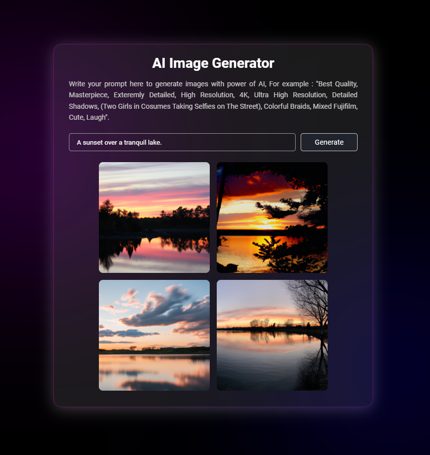

# 🎨 AI Image Generator Web App

## 🚀 Project Overview and Learning Outcomes

In this project, I built an AI image generator by following a YouTube tutorial, which I worked on during my second year at university. This was my first time using the `fetch()` function to retrieve data from an API and process it. Initially, I used OpenMidJourney's free API to generate images, and this sparked my curiosity about external APIs. I realised I could use APIs not only for generating images but also for other tasks like converting text to speech or image to text with services like Microsoft Azure. This first iteration of the project gave me a lot of inspiration for future creations as a computer science student.

Fast forward to today: after graduating from university, I decided to revisit my projects to see how I could improve them. One limitation of using OpenMidJourney's free API was that the API key only lasted for three days, meaning I constantly needed to regenerate it. With my improved understanding of `fetch()`, APIs, and backend technologies like Node.js for securely storing API keys, I decided to replace OpenMidJourney's API with OpenAI's DALL-E API. This not only eliminated the issue of re-generating keys every few days but also provided a cost-effective solution for image generation.

This time, I challenged myself to fully integrate OpenAI's API for generating images. I used Node.js with Express to set up a backend that handles requests to OpenAI, fetches the generated images, and sends them to the front end for display. Setting up the backend was crucial, as it allowed me to securely store the API key in an `.env` file something I hadn't done in the first version, where the key was exposed in the front end.

In conclusion, this project has shown me how much progress I’ve made over the past year and how far my programming skills have come. However, there’s still a lot to learn and improve, especially in areas like optimising application performance and exploring even more advanced API integrations.

---

## ✨ Features

- **🖼️ Text-to-Image Generation:** Input a descriptive prompt to generate high-quality images.
- **🌟 Multiple Image Outputs:** Generate up to 2 images per prompt to choose from.
- **📥 Downloadable Images:** Easily download generated images for personal or commercial use.

---

## 🛠️ How to Use

1. **🌐 Visit the App:** Open the AI Image Generator in your [web browser]([(https://ai-image-generator-eight-psi.vercel.app/]) .
2. **🖊️ Enter a Prompt:** Type a descriptive prompt in the input field.
   - For example, “A sunset over a tranquil lake.”
3. **🚀 Generate Images:** Click the Generate button. The app will process your request and display generated images.
4. **📥 Download Images:** Click on any image to download it to your device.

---

### 📊 Example Usage

To generate an image of "A futuristic city skyline," type the prompt and click **Generate**. You will receive several options, and you can click on any image to download it.

---

## 📸 Screenshots

---

## 🎥 Demo

Watch the demo of the AI Image Generator Web Application:

[Demo Video](https://www.youtube.com/embed/tRKcR8JPwYA?si=1OFXirv08picyRNL)

---

## 📬 Contact

If you have any questions or feedback, feel free to reach out via [iarham720@gmail.com](mailto:iarham720@gmail.com).
